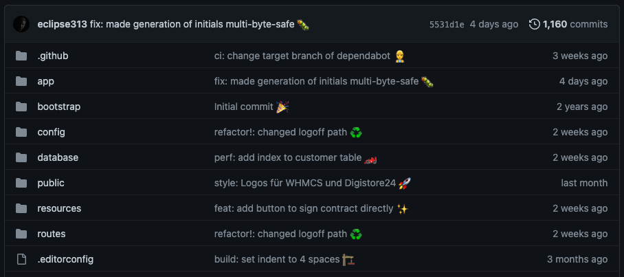
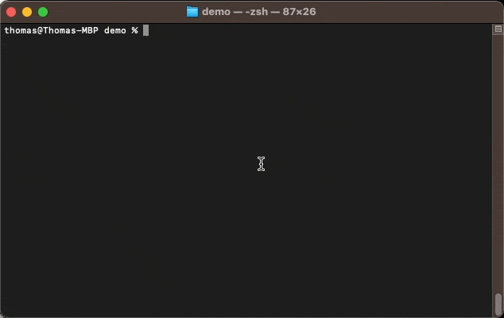
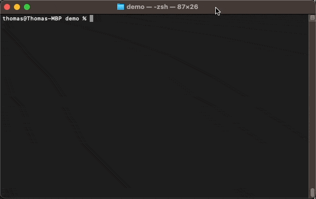

# Conventional-Commit Plus ✨

📘 [**Specification**](#specification) - 🤓 [**Cheat-Sheet**](#cheat-sheet) - :octocat: [**Git Hooks**](#automatic-setup-with-git-hooks) - 🚓 [**Commitlint**](#specification)

Conventional-Commit Plus is a round-up of my accumulated knowledge on the subject of commits. The project is on the one hand a cheat sheet with all the information I have gathered on this topic and consider useful. On the other hand this is a package that can be used to configure Commitlint. The structure proposed here is a marriage of [Conventional Commits](https://www.conventionalcommits.org) and [Gitmoji](https://gitmoji.dev/).

The following topics will be covered:

-   [General information about Conventional Commits](#about-conventional-commits)
-   [What is the benefit of Conventional Commits (Plus)?](#why-use-conventional-commits-in-general)
-   [The specifications of Conventional Commits Plus](#specification)
-   [Cheat-Sheet: available types for commits](#cheat-sheet) _← Probably you are looking for this_
-   [Automatic emojis with Git Hooks](#automatic-setup-with-git-hooks)
-   [Automatic linting with commitlint](#linting-with-commitlint)
-   [A few words in closing](concluding-remarks)

After following this guide, you may have **beautiful commit messages** in your repository that follow the well machine readable and widely used **Conventional Commits** but are still as **nice to look at** as Gitmoji. By using Git Hooks, you **won't incur any additional work** and commitlinter will ensure **high-quality commits across all contributors** and you can generate automatic changelogs or use semantic versioning:



## About Conventional Commits

The Conventional Commits specification is a lightweight convention on top of commit messages. It provides an easy set of rules for creating an explicit commit history; which makes it easier to write automated tools on top of. Check out [the specification](https://www.conventionalcommits.org) for more informations. Conventional commits, for example, make it easy to create automated changelogs.

Besides conventional commits, there are also other approaches and attempts to generalize commit messages and make them easier to understand. Another approach to classify commits is [Gitmoji](https://gitmoji.dev/). Here, instead of defined code words, emojis are used to categorize the commits.

Conventional commits define a certain structure of the commit message. An example of a commit using this structure might look like the following:

```
feat(api): allow provided config object to extend other configs
```

### Personal option and motivation

I believe that it makes sense and is necessary in larger projects to agree on a uniform standard of commits. Conventional commits are widely used and easily readable by machines due to their simple structure. Gitmoji rather follows the approach to design the commits in such a way that they are visually distinguished from each other by the emojis. Here I see the big disadvantage that the emojis look nice, but their meaning is not as clear - especially if you are not familiar with it - as the types of conventional commits.

For this reason, I decided to bring together what I consider the best of both worlds and create this repository.

## Why use Conventional Commits Plus

It is widely agreed that people can absorb information quickly, especially through visual stimuli.[^1] This is my motivation to extend conventional commits with emojis and to transfer this visual component into commits. Furthermore, the claim is not to violate any rules of conventional commits in order to maintain full support and backwards compatibility.

### Why use conventional commits in general?

The [specification](https://www.conventionalcommits.org/en/v1.0.0/#why-use-conventional-commits) of Conventional Commits summarizes the advantages nicely:

-   Making it easier for people to contribute to your projects, by allowing them to explore a more structured commit history.
-   Automatically generating CHANGELOGs.
-   Automatically determining a semantic version bump (based on the types of commits landed).
-   Communicating the nature of changes to teammates, the public, and other stakeholders.
-   Triggering build and publish processes.

## Specification

Conventional Commit Plus extends the original specification to the following commit message structure:

```
<type>[optional scope]: <description> <emoji>

[optional body]

[optional footer(s)]
```

The [original specifications](https://www.conventionalcommits.org/en/v1.0.0/#specification) are retained and are expanded as follows:

-   The `emoji` MUST be present in every commit and MUST match the specified emoji of the type.

### Example

So a complete commit message could now look like this, for example:

```
fix(api): prevent racing of requests 🐛

Introduce a request id and a reference to latest request. Dismiss
incoming responses other than from latest request.

Remove timeouts which were used to mitigate the racing issue but are
obsolete now.

Reviewed-by: eclipse313
Refs: #123
```

Examples of shorter messages might be:

```
docs: correct spelling of CHANGELOG 📚
```

```
feat(lang): add German language ✨
```

## Cheat-Sheet

### <a name="table"></a>Overview of available types

The types are oriented to [Commitlint Config Commitlint Config](https://github.com/conventional-changelog/commitlint/tree/master/@commitlint/config-conventional#type-enum), that in turn is based on the [Angular convention](https://github.com/angular/angular/blob/2.0.x/CONTRIBUTING.md#-commit-message-guidelines).

| Typ      | Emoji | Title                               |
| -------- | ----- | ----------------------------------- |
| build    | 🏗️    | [Builds](#build)                    |
| chore    | 🔧    | [Chores](#chore)                    |
| ci       | 👷    | [Continuous Integrations](#ci)      |
| docs     | 📚    | [Documentation](#docs)              |
| feat     | ✨    | [Features](#feat)                   |
| fix      | 🐛    | [Bug Fixes](#fix)                   |
| perf     | 🏎    | [Performance Improvements](#perf)   |
| refactor | ♻️    | [Code Refactoring](#refactor)       |
| revert   | ⏪️    | [Reverts](#revert)                  |
| style    | 🎨    | [Styles](#style)                    |
| test     | 🧪    | [Tests](#test)                      |
| wip      | 🚧    | [Uncompleted Changes](#wip)         |

### Detailed description of types

#### <a name="build"></a>Builds 🏗️

**Type:** `build`

Changes that related to the **build system** or **external dependencies** (example scopes: gulp, broccoli, npm), such as build scripts, package dependencies, and tools used to build the project. This can include changes to the build process, configuration files, and environment variables.

| ✅ Use for                                           | ❌ Don't use for                                                 |
| ---------------------------------------------------- | ---------------------------------------------------------------- |
| Update dependency on package X to version Y          | Update README file with instructions on how to build the project |
| Update build script to use newer version of compiler |
| Change configuration in `.prettierc`                 |

⬆️ [Back to overview](#table)

#### <a name="chore"></a>Chores 🔧

**Type:** `chore`

Changes that are made to the codebase that **don't** modify the source code itself or the test suite.

| ✅ Use for | ❌ Don't use for                    |
| ---------- | ----------------------------------- |
|            | Update the header of the login page |
|            | Changed year of copyright           |

⬆️ [Back to overview](#table)

#### <a name="ci"></a>Continuous Integrations 👷

**Type:** `ci`

Changes that are made to the **Continuous Integration (CI) system** (example scopes: Travis, Circle, BrowserStack, SauceLabs). This can include updates to the configuration files, scripts, or other tools used to automate testing and deployment.

| ✅ Use for                                                | ❌ Don't use for                            |
| --------------------------------------------------------- | ------------------------------------------- |
| Update build configuration for new deployment environment | Update dependency on package X to version Y |
| Add new automated tests to the CI pipeline                |
| Fix issue with test coverage reporting                    |

⬆️ [Back to overview](#table)

#### <a name="docs"></a>Documentation 📚

**Type:** `docs`

Changes that are made to the **documentation of the project**. This may include updates to the user guide, API documentation, README files, and other forms of documentation.

| ✅ Use for                                              | ❌ Don't use for                                             |
| ------------------------------------------------------- | ------------------------------------------------------------ |
| Update user guide with new screenshots and instructions | Provided better explanation for password reset on login page |
| Add new section to API documentation for a new feature  |
| Fix typo in README file                                 |
| Adding PHPDocs to methods in code                       |

⬆️ [Back to overview](#table)

#### <a name="feat"></a>Features ✨

**Type:** `feat`

Adding a **new feature** to the project.

| ✅ Use for                                               | ❌ Don't use for                                         |
| -------------------------------------------------------- | -------------------------------------------------------- |
| Add new search functionality to the website              | Update API documentation with new features and endpoints |
| Implement new payment processing system for checkout     | Add new test cases for new feature                       |
| Introduce new user profile page with additional features | Fixed bug on newly released feature                      |

⬆️ [Back to overview](#table)

#### <a name="fix"></a>Bug Fixes 🐛

**Type:** `fix`

Fix for a bug or issue in the project.

| ✅ Use for                                                           | ❌ Don't use for                            |
| -------------------------------------------------------------------- | ------------------------------------------- |
| Correct issue with login form validation not working                 | Adjust spacing and formatting of login page |
| Resolve issue with images not loading in Internet Explorer           | Simplify code for improved performance      |
| Fix bug causing application to crash when user clicks certain button |

⬆️ [Back to overview](#table)

#### <a name="perf"></a>Performance Improvements 🏎

**Type:** `perf`

A code change that **improves the performance** of the project.

| ✅ Use for                                             | ❌ Don't use for |
| ------------------------------------------------------ | ---------------- |
| Optimize database queries to reduce page load times    |
| Improve rendering performance of complex UI elements   |
| Implement lazy loading of images to improve page speed |

⬆️ [Back to overview](#table)

#### <a name="refactor"></a>Code Refactoring ♻️

**Type:** `refactor`

A code change that neither fixes a bug nor adds a feature

| ✅ Use for                                             | ❌ Don't use for                                                          |
| ------------------------------------------------------ | ------------------------------------------------------------------------- |
| Rename variables for improved clarity and consistency  | Changed database query to improve load time                               |
| Extract common code into a reusable function           | Convert tabs to spaces in module A to follow project indentation standard |
| Simplify complex logic to improve code readability     |
| Moved files to newly created directory for controllers |

⬆️ [Back to overview](#table)

#### <a name="revert"></a>Reverts ⏪️

**Type:** `revert`

Used to indicate that a previous commit is being undone or **reverted**.

| ✅ Use for                                  | ❌ Don't use for                  |
| ------------------------------------------- | --------------------------------- |
| Revert "Add new feature to the application" | Changed logo to version from 2022 |
| Undo changes made in commit 12345           |
| Rollback changes to database schema         |

⬆️ [Back to overview](#table)

#### <a name="style"></a>Styles 🎨

**Type:** `style`

Changes that do not affect the meaning of the code (white-space, formatting, missing semi-colons, etc).

| ✅ Use for                                   | ❌ Don't use for                                                       |
| -------------------------------------------- | ---------------------------------------------------------------------- |
| Format code according to project style guide | Change CSS of login page                                               |
| Remove trailing whitespace from files        | Improved font size and style of website                                |
|                                              | Simplify logic in function A to make it more readable                  |
|                                              | Improve error handling in module D to be more robust and maintainable  |
|                                              | Remove unnecessary dependencies from module F to simplify the codebase |

⬆️ [Back to overview](#table)

#### <a name="test"></a>Tests 🧪

**Type:** `test`

Indicate changes that add, modify, or remove **tests**.

| ✅ Use for                                           | ❌ Don't use for                         |
| ---------------------------------------------------- | ---------------------------------------- |
| Add new unit test for module X                       | Test if new landing page converts better |
| Modify existing integration test to cover edge cases |
| Remove obsolete test cases for module Y              |

⬆️ [Back to overview](#table)

#### <a name="wip"></a>Uncompleted Changes 🚧

**Type:** `wip`

Is used to indicate that a commit is a **work in progress** and is not yet complete. It is generally used when a developer wants to save their work-in-progress changes in a remote repository, such as GitHub, but is not ready to commit the changes with a more specific commit message.

It's important to note that wip is not a conventional commit type, but rather a shorthand way to indicate that a commit is a work in progress.

⬆️ [Back to overview](#table)

#### Initial commit

According to Gitmoji I suggest to use `Initial commit 🎉` as message for the first commit in a new repository without specifying a type or further information.

⬆️ [Back to overview](#table)

## Automatic setup with Git Hooks

It is possible to automatically add the emoji to the commit message by using the unique relationship between `type` and emoji. So it is possible to write "normal" conversional commits and they will be adjusted automatically.

In the following a client-side Git Hook will be created which will automatically add the correct emoji to the commit-message depending on the `type`. A Git hook is a script that Git can run before or after certain events occur, such as committing changes or pushing code to a remote repository. Git Hooks allow developers to automate certain tasks, enforce coding standards, and perform checks to ensure that code meets quality and security requirements.

To set up the git hook, all you need to do is copy the `commit-msg` file (check out the [source code](commit-msg)) from this repository and put it in the .git/hooks folder of the project in question and give the file the necessary permissions to run automatically. This can be done by the following command when executed in the project folder:

```
curl https://raw.githubusercontent.com/eclipse313/conventional-commit-plus/main/commit-msg -o .git/hooks/commit-msg
chmod +x .git/hooks/commit-msg
```

See this hook in action. Pay attention to the added emoji after the commit message based on its `type`:



## Linting with Commitlint

Commitlint is a tool that helps enforce consistent commit message formatting in Git repositories. It provides a set of rules that can be used to ensure that commit messages follow a specific pattern and format. This helps improve the readability of the commit history and makes it easier to understand the changes that have been made to a project over time.

The nice thing is: the commit format with the final emoji from this repository is backwards compatible with the default settings of commitlint. If you want to learn more about commitlint check out their [website](https://commitlint.js.org/#/).

It is possible to configure commitlint to check whether the format described in the specification is followed. To do this, you need to add this repository to your dev dependencies:

```
npm install --save-dev @eclipse313/conventional-commit-plus
```

Then you need to edit your commitlint configuration so that the `extends` array includes this repository:

```
// commitlint.config.js
module.exports = {
  extends: ['@eclipse313/conventional-commit-plus'],
};
```

After installation, three new rules are available and automatically activated:

-   **header-ends-with-emoji**: Checks if the header of the commit ends with an emoji.
-   **header-ends-with-allowed-emoji**: Checks if the header of the commit ends with one of the allowed emojis (see [types supported](#types-supported)).
-   **header-ends-with-matching-emoji**: Checks if the commit header ends with the emoji matching the type (see [types supported](#types-supported)).

See commitlint with this configuration in action:



It is possible to disable and configure the rules as usual as described in the [commitlint documentation](https://commitlint.js.org/#/reference-rules):

```js
rules: {
	"header-ends-with-emoji": [2, "always"],
	"header-ends-with-allowed-emoji": [1, "always"], // Set this rule to "warning"
	"header-ends-with-matching-emoji": [0, "always"], // Disable this rule
}
```

## Concluding remarks

I didn't think anyone would read this far. If you have any questions or suggestions, feel free to open issues in the repository. I appreciate feedback and suggestions for improvement.

– Thomas

[^1]: Rohrer, M. W.: Seeing is believing: the importance of visualization in manufacturing simulation. In: 2000 Winter Simulation Conference Proceedings (Cat. No.00CH37165). WSC 2000, Winter Simu- lation Conference, 10-13 Dec. 2000: IEEE, 2000, S. 1211–1216
